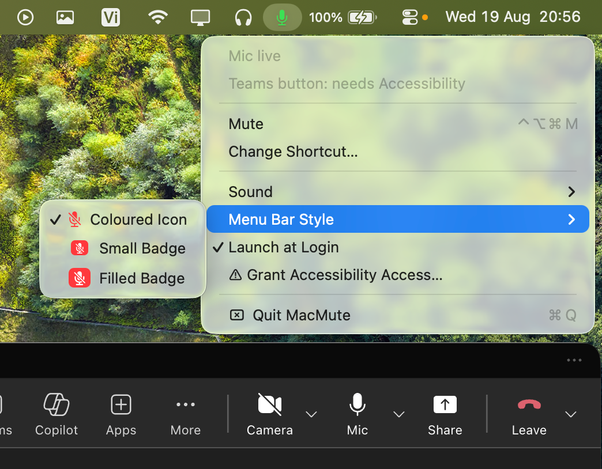

<p align="center">
  
</p>

<h1 align="center">MacMute</h1>

<p align="center">
  One shortcut to mute your mic from anywhere on macOS — built for Microsoft Teams.<br>
  <a href="https://github.com/TuanBT/MacMute/releases/latest">Download</a>
</p>

<p align="center">
  <a href="https://github.com/TuanBT/MacMute/actions/workflows/ci.yml"></a>
  <a href="https://github.com/TuanBT/MacMute/releases/latest"></a>
  
  
</p>

<p align="center">
  
</p>

Press <kbd>⌃</kbd><kbd>⌥</kbd><kbd>⌘</kbd><kbd>M</kbd> from any app and your mic goes quiet.
No need to find the Teams window first — and Teams shows you as muted too, so the room
sees it rather than just hearing silence.

## Features

- **One shortcut, from anywhere.** Configurable; the default is <kbd>⌃</kbd><kbd>⌥</kbd><kbd>⌘</kbd><kbd>M</kbd>.
- **Every microphone, not just the default one.** Teams picks its input independently of
  the macOS default, so muting only the default silences the wrong device.
- **Teams shows the mute.** MacMute presses the real Mute button in the Teams window, so
  other people in the meeting see the indicator.
- **Works for everything else too.** Zoom, Meet, Slack huddles — anything capturing audio
  is covered, because the mute happens at the device.
- **A tone on every toggle**, in four characters, or off. Falling for mute, rising for
  unmute, so you know which way it went without looking.
- **A menu bar icon that means something**, in three styles from a plain coloured glyph
  to a filled badge.
- **It never leaves your microphone dead.** Whatever it changed is put back on quit, on
  `SIGTERM`/`SIGINT`, and on the next launch if it was killed outright.
- **Nothing is polled.** CoreAudio reports capture starting and stopping; the app sits at
  0% CPU in between.
- **About 4 ms from keypress to silence**, measured with a USB microphone, a Bluetooth
  headset and a virtual device all attached.

## Install

1. Download the `.dmg` from the [latest release](https://github.com/TuanBT/MacMute/releases/latest)
   and drag **MacMute** into Applications.
2. **First launch is blocked by macOS.** MacMute has no paid Apple Developer signature, so:
   - **macOS 15 and later** — open MacMute once, let it be blocked, then go to
     **System Settings › Privacy & Security**, scroll down and click **Open Anyway**.
   - **macOS 13–14** — right-click the app and choose **Open**.
   - Or from Terminal, on any version: `xattr -cr /Applications/MacMute.app`
3. macOS asks for **Accessibility** on first launch. Grant it so MacMute can press the
   Mute button inside Teams. Muting works either way — deny it and you keep the silence,
   you just lose the indicator Teams shows to everyone else.

## Using it

The menu bar icon shows what the microphone is really doing:

| Icon | Meaning |
|---|---|
| Plain mic | Nothing is listening |
| Green mic | An app has your microphone open |
| Red crossed mic | Muted |

Green means *whatever you say right now reaches other people*. It follows the same signal
as the orange dot macOS puts in the menu bar, so it covers Teams, Zoom, Meet and Slack
alike.

Click the icon for:

| | |
|---|---|
| **Change Shortcut…** | Any combination; function keys work on their own |
| **Sound** | `Click` (default), `Soft`, `Marimba`, `Chime`, or off — picking one plays it |
| **Menu Bar Style** | `Coloured Icon` (default), `Small Badge`, `Filled Badge` |
| **Launch at Login** | |

The top of the menu always states the real state, including whether the Teams button is
being synced or still waiting for Accessibility.

## How it works

Two layers, in the order they run on a keypress:

1. **The audio device — always, and first.** MacMute sets `kAudioDevicePropertyMute` on
   *every* input device, because Teams picks its microphone independently of the macOS
   default and asking which one it chose costs more than muting all of them (measured:
   10 ms against 1.5 ms). This needs no permission, and it is the layer the menu bar
   icon believes.

   Only the device something is actually capturing from blocks the keypress; the idle
   ones are silenced a moment later on a background queue. Writing to a USB device costs
   about six times what the built-in microphone does and a Bluetooth one can cost fifty,
   and none of that affects whether you are audible right now.

   Where a device has no real mute, MacMute zeroes its input volume instead, falling back
   to the AudioHardwareService virtual main volume for devices that expose no writable
   volume channel — and keeps it at zero, because Teams raises input gain when it joins a
   meeting and would otherwise quietly reopen the microphone.

   Every write is confirmed by reading the value back. A device reporting success proves
   nothing: the virtual *Microsoft Teams Audio* device accepts both a mute and a volume
   write and then discards them.

2. **The Teams window — always.** Microsoft retired the local API that used to do this
   without any permission (`127.0.0.1:8124`): Teams 26198 still answered on it, 26213 no
   longer opens the port. What is left is the Accessibility API, so MacMute presses the
   real Mute button inside the Teams window.

   Measured against Teams 26213: locating the button takes about 35 ms the first time and
   is then cached, the press itself 0.1 ms, and Teams updates its own label about 100 ms
   later — which is why the label is never read back immediately to decide anything. All
   of it runs off the main thread, so none of it delays the shortcut.

Muting never depends on 2. With Teams closed or Accessibility denied, the shortcut still
silences the microphone.

### Quitting never leaves your mic dead

A HAL mute outlives the process that set it, so a crash could leave the microphone silent
with nothing in the macOS UI to explain it. MacMute records what each device looked like
before it touched anything, restores that on quit and on `SIGTERM`/`SIGINT`, and re-checks
it on the next launch if it was killed outright. A device you had muted yourself stays
muted.

If something ever does go wrong, this clears every input device without needing the app:

```bash
swift ReleaseUtils/unmute-all.swift
```

## Those other indicators are not MacMute

While you are muted you may see extra icons appear. None of them come from MacMute, and
one of them can be switched off:

| What you see | Whose it is |
|---|---|
| A small glyph in the menu bar | macOS Control Center. Cannot be removed by any app |
| A dot while an app uses the mic | macOS privacy indicator, shown whether or not you are muted |
| A large rounded badge below the menu bar | **Logi Options+**, if you have it. Turn it off in its own settings |

Any app that mutes at the audio device triggers these, because they react to the
microphone being muted rather than to whoever muted it.

## Requirements

- macOS 13 or later
- **Accessibility** to sync the Teams button; muting itself needs no permission
- Microsoft Teams optional — the audio device layer handles everything without it

## Build from source

Swift Package Manager, no dependencies. Xcode command line tools are enough.

```bash
git clone https://github.com/TuanBT/MacMute.git
cd MacMute
swift test          # muting logic, against devices that misbehave
./build.sh          # builds dist/MacMute.app
```

The decisions about what to mute live in `Sources/MacMuteCore`, free of CoreAudio, so
they can be tested against a fake device that accepts writes and ignores them — which is
how a real one behaves. `MACMUTE_TIMING=1` makes the app print a breakdown of every
keypress to stderr.

The feedback tones are generated, not recorded:

```bash
python3 ReleaseUtils/make-sounds.py
```

See [`ReleaseUtils/`](ReleaseUtils/) for the full release pipeline. Pushing a `v*` tag
builds and publishes a release from GitHub Actions.

## License

[MIT](LICENSE)
