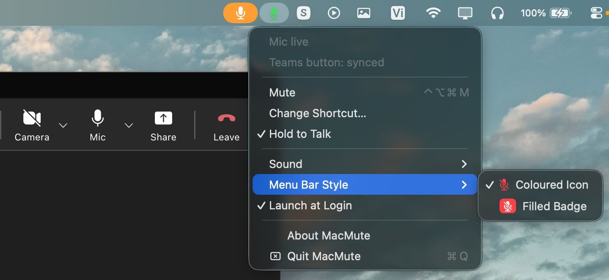

<p align="center">
  
</p>

<h1 align="center">MacMute</h1>

<p align="center">
  One shortcut to mute your mic from anywhere on macOS.<br>
  <a href="https://github.com/TuanBT/MacMute/releases/latest">Download</a>
</p>

<p align="center">
  <a href="https://github.com/TuanBT/MacMute/actions/workflows/ci.yml"></a>
  <a href="https://github.com/TuanBT/MacMute/releases/latest"></a>
  
  
</p>

<p align="center">
  
</p>

Press <kbd>⌃</kbd><kbd>⌥</kbd><kbd>⌘</kbd><kbd>M</kbd> from any app and your mic goes quiet — no need to
find the right window first.

MacMute is a free, open-source menu bar app that gives macOS the global microphone mute
hotkey it never shipped with. It mutes the audio device itself, so a single shortcut
covers every app at once and keeps working while you are looking at something else.

## Why MacMute?

MacMute mutes your microphone at the **device level**, so it works with every app:
**Microsoft Teams, Zoom, Google Meet, Slack, Discord, FaceTime** — anything that captures
audio is covered.

Every meeting app has its own mute shortcut, and they share one limitation: **they only
listen while their own window is in front.** Teams, Zoom and Meet all stop hearing you the
moment you switch to your editor, your browser or your notes — which is exactly when you
need to mute. MacMute sits below all of them and answers wherever you are.

For Microsoft Teams specifically, MacMute also presses the in-app Mute button so other
participants see you as muted, not just silent. The local API that third-party apps used
for this **no longer answers**: Teams 26198 still opened port 8124, 26213 does not. The
Accessibility API is the remaining way to keep that indicator in sync.

## Features

- **Global shortcut from anywhere** — configurable, default <kbd>⌃</kbd><kbd>⌥</kbd><kbd>⌘</kbd><kbd>M</kbd>
- **Hold to Talk** — optional, off by default. Tap the shortcut to toggle as always; hold
  it and the microphone only changes while the key is down — push-to-talk while muted,
  push-to-mute while live. Teams, Zoom and Meet each ship something similar, but only
  while their window has focus; this one does not care what you are looking at
- **Mutes every microphone** — not just the system default, because apps like Teams can pick
  a different input device
- **Teams mute indicator sync** — presses the real Mute button inside the Teams window
  (requires Accessibility permission)
- **Works with all apps** — Zoom, Meet, Slack, Discord, FaceTime, and more
- **Audio feedback** — four sound styles (Click, Soft, Marimba, Chime) or off; falling tone
  for mute, rising for unmute. Hover over each option to preview the sound live
- **Menu bar icon** — two styles to choose from (Coloured Icon or Filled Badge); colour shows mic status at a glance
- **Safe** — restores all microphones on quit, on crash signals, and on next launch
- **Lightweight** — 0% CPU when idle, nothing polled while you are not pressing anything,
  about 4 ms from keypress to silence
- **Launch at Login** — start automatically with macOS

## Install

1. Download the `.dmg` from the [latest release](https://github.com/TuanBT/MacMute/releases/latest)
   and drag **MacMute** into Applications.

2. **Clear the quarantine flag.** MacMute is signed ad-hoc rather than with a paid Apple
   Developer ID, so macOS blocks it until you do. Run this once in Terminal:

   ```bash
   xattr -cr /Applications/MacMute.app
   ```

   Alternatively: open MacMute, let it be blocked, then go to
   **System Settings › Privacy & Security** and click **Open Anyway**.

3. On first launch, macOS asks for **Accessibility** permission. Grant it so MacMute can
   press the Mute button inside Teams. Deny it and muting still works — you only lose the
   visible mute indicator in Teams.

   The ad-hoc signature changes on every release, so when upgrading, remove the old
   MacMute entry from that list before granting it again.

## Menu bar icon

The icon shows the real state of your microphone:

| Icon | Meaning |
|---|---|
| Plain mic | Nothing is listening |
| Green mic | An app has your microphone open |
| Red crossed mic | Muted |

Click the icon for settings:

| Option | Description |
|---|---|
| **Change Shortcut…** | Set any key combination (live modifier preview, reset to default) |
| **Hold to Talk** | Tap to toggle; hold the shortcut to change the mic only while the key is down |
| **Sound** | Click, Soft, Marimba, Chime, or Off — hover to preview |
| **Menu Bar Style** | Coloured Icon or Filled Badge |
| **Launch at Login** | Start with macOS |
| **About MacMute** | Version info and GitHub link |

## FAQ

### How do I mute my microphone on macOS with a keyboard shortcut?

macOS has no built-in global mute hotkey — the mute key on a Mac keyboard silences output,
not your microphone. MacMute adds the missing one: press <kbd>⌃</kbd><kbd>⌥</kbd><kbd>⌘</kbd><kbd>M</kbd>
from any app, or bind whatever combination you prefer.

### Does it mute every app, or only the one in front?

Every app. MacMute writes to the audio device through CoreAudio rather than asking any
particular program to be quiet, so Zoom, Google Meet, Slack, Discord, FaceTime, OBS and
anything else recording at that moment all go silent together. It mutes every input
device, not just the current default, because apps sometimes pick a different one.

### Microsoft Teams already has a push-to-talk shortcut. Why use this?

Teams does have one — hold <kbd>⌥</kbd><kbd>Space</kbd> once you enable *Keyboard shortcut
to unmute* in Settings › Privacy. So do Zoom and Google Meet. All three share a limit:
they only respond while their own window is in front. The moment you are reading a
document, checking code or taking notes, the shortcut is not listening. MacMute's works
from wherever you actually are, and mutes the device rather than the app.

### My Teams mute tool stopped working — can MacMute replace it?

If it talked to Teams over the local API on port 8124, that route is gone: Teams 26198
still opened the port, 26213 does not. MacMute never depended on it. Muting happens in the
audio device, which no vendor can retire, and the Teams button is pressed through the
Accessibility API instead.

### How is this different from other mute utilities?

Three things, and each is checkable rather than a matter of taste: it mutes at the device
level so no app can talk over it, it presses the Teams Mute button so people see you muted
instead of merely hearing nothing, and it is MIT-licensed with no account, no telemetry
and no network access.

### Is it free?

Yes — free, open source, MIT licensed. No account, no subscription, no analytics.

### What permissions does it need?

Muting needs none at all. **Accessibility** is only used to press the Mute button inside
Teams; deny it and everything else still works, you simply lose the in-app indicator.
MacMute never asks for microphone access, because it silences the device rather than
listening to it.

### Does it work with AirPods, USB microphones and Bluetooth headsets?

Yes. Anything macOS lists as an input device is muted, and MacMute keeps up as devices are
plugged in and removed. Devices that accept a mute and quietly ignore it — some virtual
ones do — are detected and silenced by dropping their input level instead.

### macOS says MacMute is damaged or from an unidentified developer

It is not signed with a paid Apple Developer ID. Run `xattr -cr /Applications/MacMute.app`
once, or open it and click **Open Anyway** in System Settings › Privacy & Security. See
[Install](#install).

### Can I put Hold to Talk on a mouse button?

Not through your mouse software. A button remapped to a keyboard shortcut in Logitech
Options+ — and in every remapper that works this way — sends the whole combination as one
instant press-and-release, measured at 3 ms here, however long you actually hold the
button down. The length of your press never leaves the mouse driver, so MacMute receives
a tap and toggles. Such a button is fine for toggling; it cannot do push-to-talk.

### Does Hold to Talk work with Microsoft Teams?

Yes, and it presses the Teams Mute button on both edges, which it has to. That button is
a second, app-level mute: opening the microphone without pressing it would leave you
talking while Teams still shows you — and treats you — as muted.

### What happens if macOS never reports that I let go?

It can happen: the hotkey release event goes missing if the modifiers come up before the
key. MacMute also watches the modifier keys themselves, gives up on any hold after 30
seconds, and ends one on sleep, on a locked screen, and on a switched session. A hold that
goes missing always ends with the microphone back where it started, never left open.

## Requirements

- macOS 13 or later
- **Accessibility** permission — for Teams mute button sync (muting itself needs no permission)

## Build from source

```bash
git clone https://github.com/TuanBT/MacMute.git
cd MacMute
swift test
./build.sh       # builds dist/MacMute.app
```

## License

[MIT](LICENSE)
