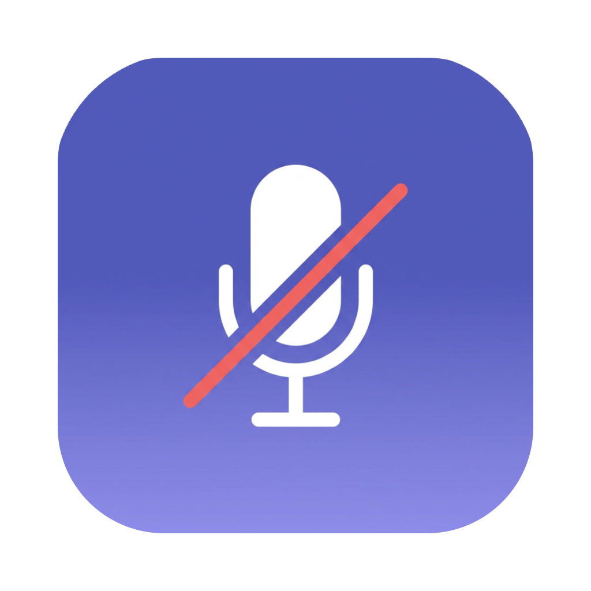
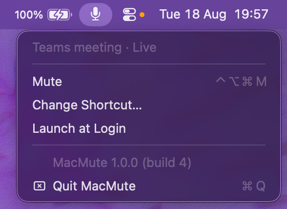

<p align="center">
  
</p>

<h1 align="center">MacMute</h1>

<p align="center">
  Global mute shortcut for macOS, built for Microsoft Teams.<br>
  <a href="https://tuanbt.github.io/MacMute/">Website</a> ·
  <a href="https://github.com/TuanBT/MacMute/releases/latest">Download</a>
</p>

<p align="center">
  <a href="https://github.com/TuanBT/MacMute/actions/workflows/ci.yml"></a>
  <a href="https://github.com/TuanBT/MacMute/releases/latest"></a>
  
  
</p>

<p align="center">
  
</p>

Press one shortcut from anywhere and Teams flips its own mute button — no window focus,
no third-party API, so it keeps working when your organisation disables the Teams
third-party app API.

## How it works

Two paths, picked automatically:

1. **In a Teams meeting** — MacMute presses the real "Mute mic" button through the
   macOS Accessibility API (~0.2 ms). Because Teams performs its own action, the Teams
   window updates instantly and everyone in the meeting sees the correct state. MacMute
   also reads the button's label back, so the menu bar icon can never drift out of sync
   with Teams — including when you mute by clicking inside Teams.
2. **No Teams meeting** — MacMute mutes the default input device through CoreAudio,
   which covers Zoom, Google Meet, Slack huddles and anything else. Those apps are
   genuinely muted, but their own UI will not show it; no API-free tool can do better.

Muting the audio device is deliberately *not* used for Teams: Teams only notices a
device-level mute after its own polling delay, which is exactly the lag this app exists
to remove.

Sending a synthetic Cmd+Shift+M to the Teams process was tried first and does **not**
work — MSWebView2 ignores key events while its window is not the key window. Pressing
the accessibility element is what works.

## Menu bar icon

| Icon | Meaning |
|---|---|
| Thin mic | No meeting, mic live |
| Filled mic | In a Teams meeting, mic live |
| Red crossed mic | Muted |

## Install

Download the `.dmg` from the [latest release](https://github.com/TuanBT/MacMute/releases/latest),
drag **MacMute** into Applications, then right-click the app → **Open** the first time —
it is ad-hoc signed and not notarised, so a plain double-click is blocked by Gatekeeper.

## Requirements

- macOS 13 or later
- **Accessibility permission** — System Settings › Privacy & Security › Accessibility.
  Required for the Teams path. Without it MacMute still mutes the input device.

## Build

```bash
./build.sh                       # builds dist/MacMute.app
./build.sh --release             # same, but bumps the build number first
./package-dmg.sh                 # dist/MacMute-<version>-<build>.dmg
./ReleaseUtils/build_release.sh  # the whole release: icon, app, .dmg, .zip, .pkg
```

`ReleaseUtils/build_release.command` is the same thing, double-clickable from Finder.

Pushing a `v*` tag runs `.github/workflows/release.yml`, which runs that same script on a
macOS runner and publishes the artifacts to a GitHub release. Every push to `main` and
every pull request is built by `.github/workflows/ci.yml`.

Version lives in `VERSION`, build number in `BUILD`; both are shown at the bottom of the
Change Shortcut panel, so you can tell which build is installed.

## App icon

Everything is generated from one file, `Resources/AppIcon.source.jpg` — the raw 1024 px
render from an AI logo tool:

```bash
./ReleaseUtils/make-icon.sh
#  -> Resources/AppIcon.png    1024px master, rounded tile, transparent corners
#  -> Resources/AppIcon.icns   what the .app bundle ships
#  -> docs/assets/icon.png     what this README and the website show
```

To change the icon, overwrite `Resources/AppIcon.source.jpg` (or `.png`), run that
script, and commit all four files — GitHub Actions does not regenerate the icon.
`build_release.sh` reruns it by itself when the render is newer than the `.icns`.

AI tools return a full-bleed square with a white background; macOS wants a rounded tile
with transparent corners on Apple's 824-in-1024 grid. `ReleaseUtils/mask-icon.swift`
does that conversion, which is why the Dock does not show white corners.

## Note on updates

The app is ad-hoc signed, so its signature changes on every build and macOS asks you to
re-approve Accessibility after each update. Remove the old entry in System Settings ›
Privacy & Security › Accessibility and add the new one. Signing with a paid Apple
Developer ID would make the approval stick across updates.

## Layout

| Path | Purpose |
|---|---|
| `Sources/MacMute/TeamsController.swift` | Finds and presses the Teams mute button; caches the element |
| `Sources/MacMute/AudioController.swift` | CoreAudio fallback on the default input device |
| `Sources/MacMute/Shortcut.swift` | Shortcut model and the Carbon global hotkey |
| `Sources/MacMute/ShortcutRecorder.swift` | Panel for rebinding the shortcut |
| `Sources/MacMute/AppDelegate.swift` | Menu bar item, menu, state polling |
| `docs/index.html` | Landing page served by GitHub Pages from `/docs` |
| `ReleaseUtils/` | Release tooling: build script, icon pipeline, pkg install scripts |
